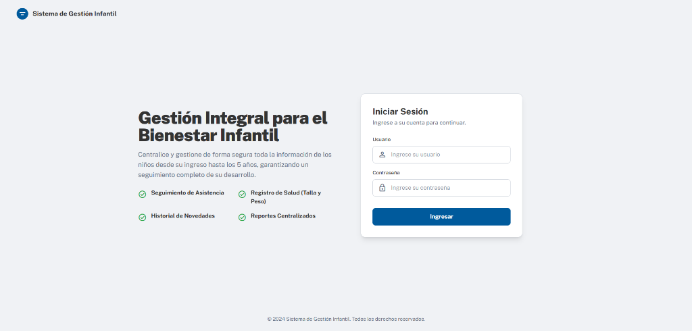
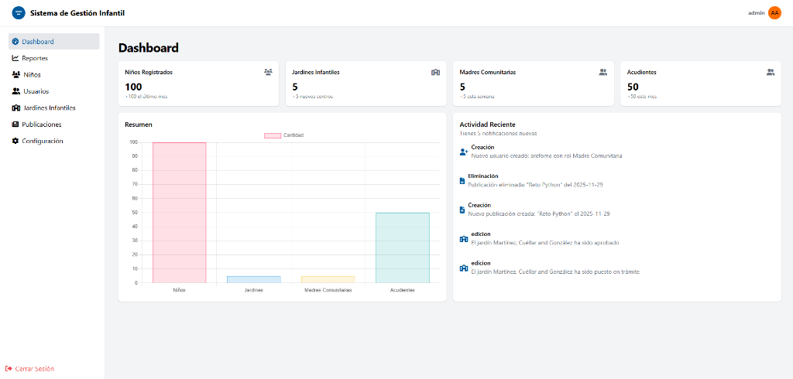
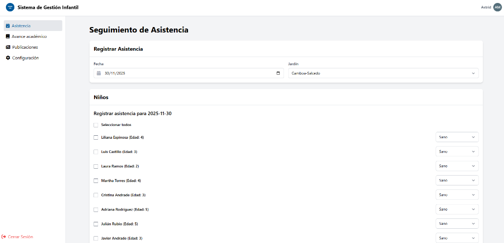
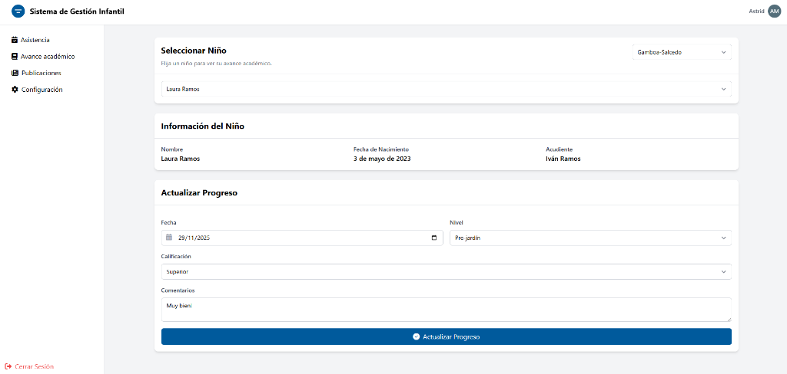
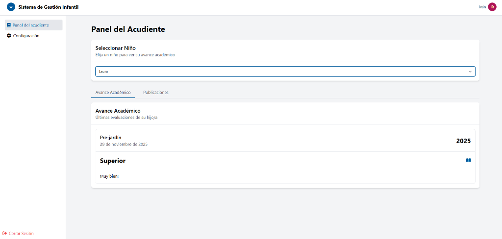

# Sistema de Gestión Infantil

## Descripción

Este proyecto es un sistema de gestión para jardines infantiles. Está diseñado para administrar información relacionada con jardines infantiles, niños, madres comunitarias y acudientes.

## Características principales

-   Gestión de usuarios (administradores, madres comunitarias, acudientes)
-   Administración de jardines infantiles
-   Registro y seguimiento de niños
-   Control de asistencia
-   Generación de reportes
-   Sistema de publicaciones

## Tecnologías utilizadas

-   Django (Backend)
-   HTML, HTMX, CSS, JavaScript (Frontend)
-   Tailwind CSS (Estilos)
-   SQLite (Base de datos)
-   Django Background Tasks (Tareas programadas)
-   NodeJS (Manejo de paquetes de javascript)

## Instalación

1. Clona el repositorio
2. Instala nvm si no lo tienes instalado, puedes seguir esta guía: https://www.freecodecamp.org/news/node-version-manager-nvm-install-guide/
3. Crea un entorno virtual:
    ```
    python -m venv venv
    ```
4. Activa el entorno virtual:
    - Windows: `venv\Scripts\activate`
    - macOS/Linux: `source venv/bin/activate`
5. Instala las dependencias:
    ```
    pip install -r requirements.txt
    ```
6. Configura la base de datos en `settings.py`
7. Crea las migraciones:
    ```
    python manage.py makemigrations
    ```
8. Ejecuta las migraciones:
    ```
    python manage.py migrate
    ```
9. Instala tailwind y carga los estilos:
    ```
    python manage.py tailwind install
    python manage.py tailwind start
    ```
10. Llena la base de datos con datos de prueba (opcional):
    ```
    python manage.py populate
    ```
11. Inicia el servidor de desarrollo:
    ```
    python manage.py runserver
    ```
12. Para el envio de correos por gmail es necesario crear un archivo .env con el siguiente contenido:
    ```
    EMAIL_HOST_USER=tu_correo@gmail.com
    EMAIL_HOST_PASSWORD=tu_contraseña
    ```

## Primer Uso - Crear Administrador

Tienes dos opciones para crear el primer usuario administrador:

### Opción 1: Usar datos de prueba (Recomendado para desarrollo)

Si ejecutaste el comando `python manage.py populate` en el paso 10 de la instalación, ya tienes un usuario administrador creado:

- **Username:** `admin`
- **Password:** `admin`

### Opción 2: Crear un administrador personalizado

Si prefieres crear tu propio usuario administrador:

```bash
python manage.py createsuperuser
```

Ingresa los datos solicitados (username, email opcional, password).

---

Una vez creado el administrador, inicia sesión en `http://127.0.0.1:8000/login/` para acceder al dashboard y crear otros usuarios (madres comunitarias, acudientes).

## Estructura del proyecto

-   `project_core/`: Directorio principal del proyecto
    -   `usuarios/`: Aplicación para gestión de usuarios
    -   `jardines/`: Aplicación para gestión de jardines
    -   `niños/`: Aplicación para gestión de niños
    -   `publicaciones/`: Aplicación para gestión de publicaciones
    -   `reportes/`: Aplicación para generación de reportes
    -   `templates/`: Plantillas HTML
    -   `static/`: Archivos estáticos (CSS, JS, imágenes)
    -   `media/`: Archivos subidos por los usuarios

## Comandos útiles

-   Poblar la base de datos con datos de prueba:
    ```
    python manage.py populate
    ```
-   Crear tareas programadas:
    ```
    python manage.py schedule_tasks
    ```
-   Correr tareas programadas:
    ```
    python manage.py process_tasks
    ```

## Capturas de Pantalla

### Página de Inicio de Sesión
Interfaz moderna y profesional para el acceso al sistema.



### Dashboard Administrativo
Vista general con estadísticas de niños registrados, jardines infantiles, madres comunitarias y acudientes, junto con actividades recientes del sistema.



### Registro de Asistencia
Interfaz para que las madres comunitarias registren la asistencia diaria de los niños, con estados personalizados (Sano, Enfermo, Decaído, No asistió).



### Avance Académico
Sistema de seguimiento del progreso académico de cada niño, permitiendo registrar evaluaciones por nivel educativo.



### Panel del Acudiente
Vista personalizada para que los acudientes consulten el avance académico de sus hijos y accedan a publicaciones relevantes.


